# Canto

Widget de desktop (Windows, macOS e Linux) que vive no **canto inferior direito** da tela:
checklist do dia, cards de notas pesquisáveis, histórico de área de transferência,
transcrições das últimas reuniões e a agenda do dia — tudo cifrado em disco e
sincronizado com o Google Drive sem que o Google consiga ler nada.

Abas: **tarefas · notas · clipboard · reuniões · agenda · sync**.

| Tarefas do dia | Cards pesquisáveis |
|---|---|
| 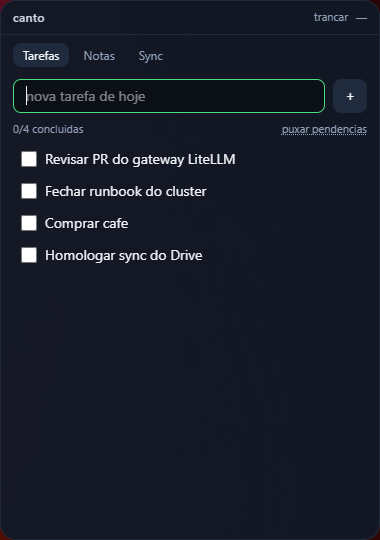 | 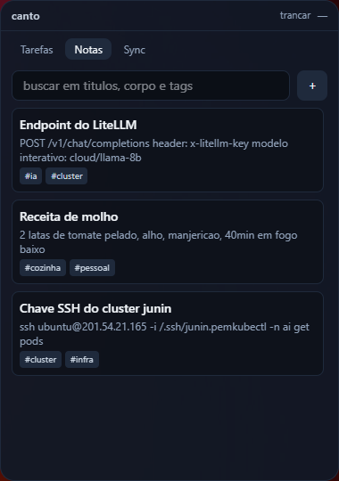 |
| 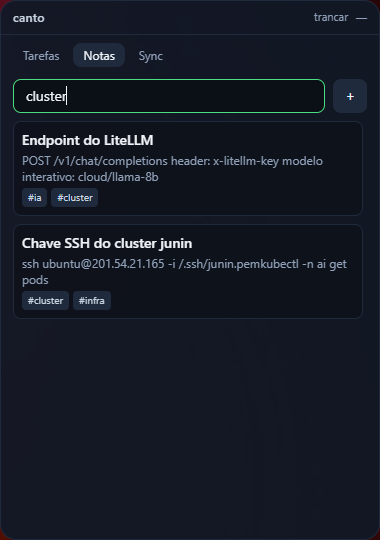 | 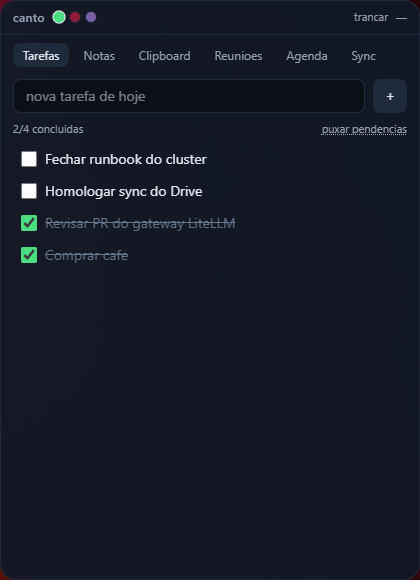 |

Stack: **Tauri v2 + React 19 + TypeScript + Tailwind v4**, núcleo de cofre em Rust.

## Modelo de segurança

| Item | Decisão |
|---|---|
| Derivação de chave | Argon2id (19 MiB, t=2, p=1), salt aleatório de 16 bytes por cofre |
| Cifra | AES-256-GCM, nonce novo a cada gravação, AAD fixando o domínio (`canto.vault.v1`) |
| Chave | só existe em RAM enquanto o cofre está destrancado; zeroizada ao trancar/sair |
| Sync | o Drive recebe **apenas o envelope cifrado**; a fusão acontece local, em claro, na RAM |
| Escopo OAuth | `drive.appdata` (pasta privada do app), `calendar.events.readonly` (só leitura da agenda) e `openid email` (mostrar de quem é a conta). O widget não enxerga o resto do seu Drive |
| Clipboard | histórico fica **só na máquina** (`clipboard.json`, cifrado), fora do `vault.json` — nunca sobe para o Drive |
| Transcrições | leitura restrita à pasta configurada, extensões `txt/md/vtt/srt`, nome de arquivo validado contra travessia de caminho |
| OAuth | Authorization Code + **PKCE (S256)** com loopback em `127.0.0.1:porta-efêmera` e checagem de `state` |
| Tokens | `refresh_token` guardado cifrado com a mesma chave do cofre (`drive.json`) |
| Auto-lock | 15 min sem uso deliberado do cofre e o widget se tranca sozinho, avisando na tela. Polling de fundo (clipboard, agenda) não conta como uso |
| Gravação | escrita em arquivo temporário com `fsync` antes do `rename`: queda de energia não deixa envelope pela metade |
| CSP | sem origens remotas; toda a rede sai pelo processo Rust, nunca pela webview |

Perder a senha mestra significa perder os dados: não há recuperação, nem local nem no Drive.

| Cofre trancado | Senha errada |
|---|---|
| 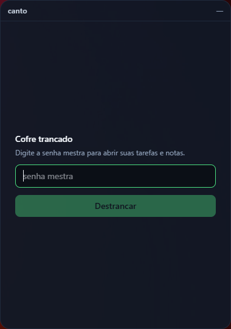 | 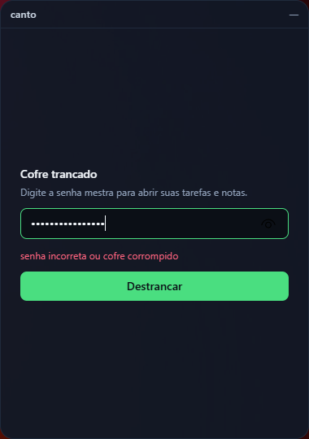 |

## Rodando

```bash
bun install
bun run tauri dev      # desenvolvimento
bun run tauri build    # instalador da plataforma atual
```

Testes do núcleo (cripto, merge de sync, callback OAuth, auto-lock, gravação atômica):

```bash
cd src-tauri && cargo test
```

Testes da interface (relógio do dia, disparo do aviso de reunião):

```bash
bun test
```

## Conectando o Google Drive

1. No Google Cloud Console: **APIs e serviços → Credenciais → Criar credencial → ID do cliente OAuth → App para computador**.
2. Habilite a **Google Drive API** no mesmo projeto.
3. Habilite também a **Google Calendar API** se quiser a aba de agenda.
4. Na aba **sync** do widget, cole o *Client ID* (e o *client secret*, que o Google emite para apps desktop) e salve.
5. **conectar conta** abre o navegador; ao autorizar, o widget captura o code na porta loopback
   e passa a exibir o e-mail da conta conectada.
6. **sincronizar agora** faz pull + merge + push.

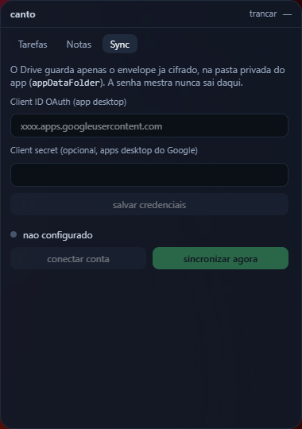

O mesmo cofre em outra máquina: crie o cofre local **com a mesma senha mestra**, configure o Drive
e sincronize — o merge traz o conteúdo remoto.

## Sincronização

Last-write-wins por item (`updated_at` em ms) com lápides para remoções:

- item editado nos dois lados → vence a edição mais recente;
- item apagado em A e editado em B → vence quem tem o carimbo mais novo;
- merge é idempotente e comutativo nos casos acima (coberto por `tests/merge.rs`).

## Abas locais

- **clipboard** — o Rust observa a área de transferência, guarda os últimos itens (com dedupe,
  fixar e limite de tamanho) e permite copiar de volta. Local por definição, nunca sincronizado.
- **reuniões** — lista as transcrições da pasta configurada (padrão `~/Documents/Transcricoes`),
  limpando numeração/timestamps de `vtt`/`srt` para virar texto corrido pesquisável.
- **agenda** — eventos do dia do Google Calendar. Um minuto antes do início, o widget aparece,
  toca um aviso sonoro e abre um overlay com título, horário, local e o botão **entrar no Meet**
  quando o evento tem link. O relógio do aviso vive no App, não na aba: dispara com você em
  qualquer aba ou com o widget escondido. `Esc` fecha o overlay.

| Clipboard local | Últimas transcrições |
|---|---|
| 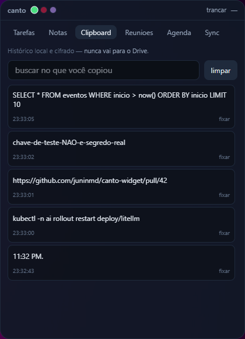 | 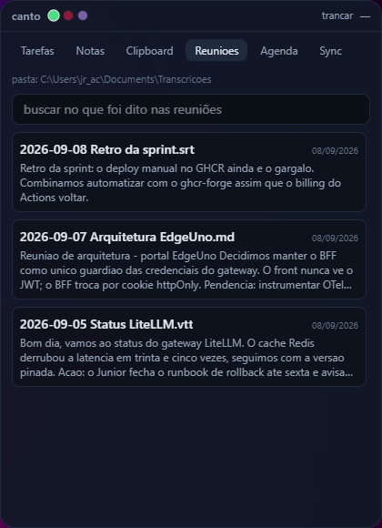 |
| 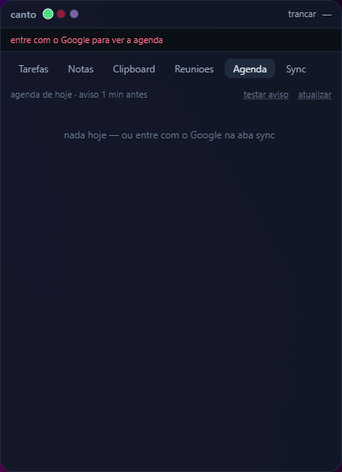 | 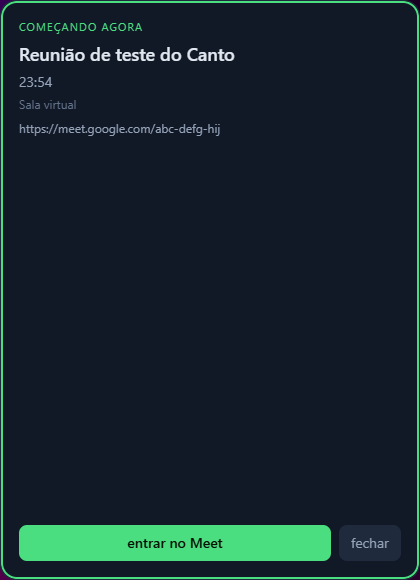 |

## Aparência e atalho

- Skins: **padrão**, **Hueco Mundo** (Bleach) e **Drácula**, trocáveis pelos pontos no cabeçalho.
- Atalho global **Ctrl+Alt+Espaço** (`Cmd+Alt+Espaço` no macOS) mostra/esconde o widget.
- **tarefas** — clique duplo no título renomeia a tarefa; `Enter` confirma, `Esc` cancela.
- **notas** — no editor, `Ctrl+Enter` salva e `Esc` cancela.
- A lista de tarefas vira sozinha à meia-noite, sem precisar reabrir o widget.

| padrão | Hueco Mundo | Drácula |
|---|---|---|
| 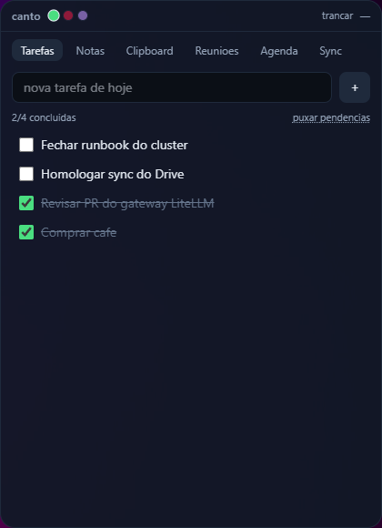 | 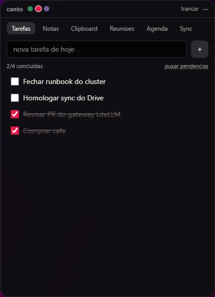 | 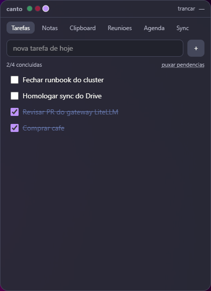 |

Atalho global escondendo e trazendo o widget de volta:

| Ctrl+Alt+Espaço | Ctrl+Alt+Espaço de novo |
|---|---|
| 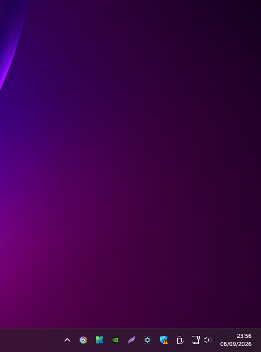 | 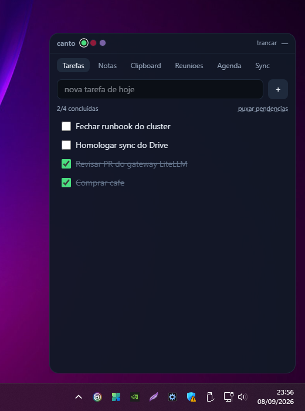 |

## Janela

- Ancorada na **work area** do monitor atual (fora da barra de tarefas/dock), margem de 16 px.
- Sem decoração, sempre no topo, fora da barra de tarefas; arraste pelo cabeçalho.
- Fechar apenas esconde. Ícone na bandeja: mostrar/esconder, trancar cofre, sair.

## Onde ficam os arquivos

`app_data_dir` da plataforma (ex.: `%APPDATA%\com.junin.canto` no Windows):

- `vault.json` — envelope cifrado com tarefas e notas;
- `drive.json` — credenciais OAuth, cifradas com a mesma chave;
- `clipboard.json` — histórico da área de transferência, cifrado e nunca sincronizado;
- `settings.json` — preferências não sensíveis (pasta de transcrições, skin).
