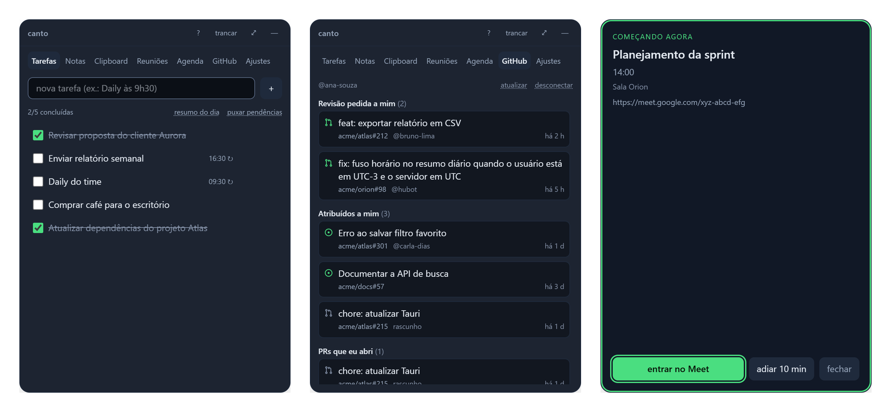
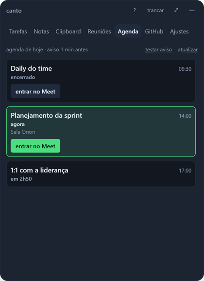
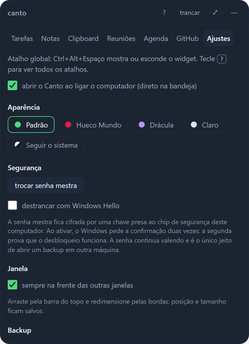

<div align="center">

# Canto

**O seu dia inteiro num widget de canto de tela — cifrado, local e sem servidor.**

Tarefas com lembrete · notas · histórico do clipboard · agenda com aviso de reunião · transcrições · issues e PRs do GitHub

[](https://github.com/juninmd/canto-widget/actions/workflows/ci.yml)
[](https://github.com/juninmd/canto-widget/releases)
[](LICENSE)




</div>

## Por que o Canto

Quem vive entre reuniões, PRs e pequenas pendências acaba com cinco apps abertos: um para tarefas, outro para
notas, um gerenciador de clipboard, o calendário e as notificações do GitHub. O Canto junta tudo numa janela
pequena presa ao canto inferior direito, que aparece com `Ctrl+Alt+Espaço` e some quando você não precisa dela.

- 🔒 **Cifrado por padrão.** Argon2id + AES-256-GCM com senha mestra; a chave só existe em RAM. Windows Hello opcional.
- 🏠 **Seus dados ficam na sua máquina.** Zero telemetria, zero servidor, nenhuma conta obrigatória. Backup é um arquivo `.canto` cifrado.
- 🪶 **Leve.** Tauri v2 (Rust + webview do sistema) em vez de Electron. Veja os [números medidos](docs/benchmark.md#footprint-medido).
- ⏰ **Não deixa você perder a hora.** O widget aparece, toca um som e manda notificação do sistema 1 min antes da reunião e na hora do lembrete, com **adiar 10 min**.

## O que tem dentro

| | Aba | O que faz |
|---|---|---|
| ✅ | **Tarefas** | Checklist do dia com horário e recorrência (todo dia, dias úteis, semanal). Digite `Daily às 9h30` e o lembrete já sai marcado. |
| 🗒️ | **Notas** | Cards pesquisáveis com `#tags`, fixar no topo e filtro por tag. |
| 📋 | **Clipboard** | Histórico cifrado com busca e fixar; reconhece link, cor e código. Cópias gigantes (um log de 100 MB) não travam nada: guarda o começo e avisa. Ignora o que gerenciadores de senha marcam como sensível (Windows). |
| 🎙️ | **Reuniões** | Transcrições (`.vtt`, `.srt`, `.txt`, `.md`) de uma pasta local, limpas e pesquisáveis. |
| 📅 | **Agenda** | Eventos do dia do Google Calendar, com **entrar no Meet** e aviso 1 min antes. |
| 🐙 | **GitHub** | Revisão pedida a mim, atribuídos a mim, PRs e issues que eu abri. Token pessoal ou login pelo navegador. |
| ⚙️ | **Ajustes** | 5 skins (inclui clara e "seguir o sistema"), troca de senha mestra, Windows Hello, backup, início com o sistema. |

Tudo por teclado: `Alt+1`…`Alt+7` trocam de aba, `N` cria, `/` busca, `F11` tela cheia, `Alt+L` tranca e `?` lista os atalhos.

## Galeria

| Tarefas | Notas | Clipboard | Agenda |
|---|---|---|---|
|  |  |  |  |
| **Aviso de reunião** | **Lembrete de tarefa** | **Cofre trancado** | **Ajustes** |
|  |  |  |  |
| **Conectar o GitHub** | **Trocar senha mestra** | **Skin clara** | **Skin Drácula** |
|  |  |  |  |

<details>
<summary>Tela cheia (<code>F11</code>)</summary>


</details>

Todos os prints usam dados fictícios.

## Comparado com o que já existe

Nenhuma das ferramentas pesquisadas cobre mais de duas destas frentes ao mesmo tempo. Fontes e detalhes em
[docs/benchmark.md](docs/benchmark.md).

| | Tarefas + lembrete | Notas | Clipboard | Reunião | GitHub | Cifra local por padrão |
|---|:-:|:-:|:-:|:-:|:-:|:-:|
| **Canto** | ✅ | ✅ | ✅ | ✅ | ✅ | ✅ |
| Todoist / TickTick | ✅ | ➖ | — | — | — | — |
| Obsidian / Joplin | ➖ | ✅ | — | — | — | ➖ só no sync |
| Raycast | ➖ | ✅ | ✅ | ➖ | ➖ | ? |
| CopyQ / Ditto | — | — | ✅ | — | — | ➖ opcional |
| MeetingBar | — | — | — | ✅ | — | n/a |
| Gitify | — | — | — | — | ✅ | n/a |

✅ nativo · ➖ parcial, via extensão ou opcional · — não tem · ? não publicado · n/a não guarda dados do usuário

O que o benchmark trouxe para cá: **horário direto no título da tarefa** (Todoist/TickTick), **adiar aviso**
(TickTick) e **clipboard que respeita gerenciadores de senha** (CopyQ/Ditto).

## Instalar

Baixe o instalador da sua plataforma em [Releases](https://github.com/juninmd/canto-widget/releases):
Windows (`.msi` ou `.exe`), macOS Apple Silicon e Intel (`.dmg`) e Linux (`.deb`, `.rpm` ou `.AppImage`).

> Os instaladores ainda não têm assinatura de código: o SmartScreen (Windows) e o Gatekeeper (macOS) avisam na
> primeira abertura.

Na primeira execução você cria a senha mestra. **Não há recuperação**: perder a senha é perder os dados.

## Segurança em uma tela

| | |
|---|---|
| Cofre | Argon2id (19 MiB, t=2) → AES-256-GCM, nonce novo a cada gravação, gravação atômica com `fsync` |
| Chave | só em RAM, zerada ao trancar; auto-lock após 15 min sem uso |
| Rede | só o processo Rust fala com a rede; a webview não tem origem remota (CSP) e nunca vê tokens |
| Google | opcional, só `calendar.events.readonly` + perfil, OAuth com PKCE e loopback |
| GitHub | opcional, token cifrado; itens só abrem se o link for `https://github.com/` |

Modelo completo, backup, merge entre máquinas e onde cada arquivo fica: [docs/seguranca.md](docs/seguranca.md).
Achou uma falha? [SECURITY.md](SECURITY.md).

## Documentação

- [Guia de uso](docs/uso.md): abas, tarefas recorrentes, atalhos, skins, acessibilidade, janela e início com o sistema.
- [Integrações](docs/integracoes.md): agenda do Google e GitHub (token pessoal ou device flow).
- [Segurança e dados](docs/seguranca.md): modelo de ameaça, backup `.canto`, merge, troca de senha, arquivos em disco.
- [Benchmark](docs/benchmark.md): Todoist, TickTick, Obsidian, Joplin, Raycast, PowerToys, CopyQ, Ditto, MeetingBar e Gitify.
- [CHANGELOG](CHANGELOG.md) · [Como contribuir](CONTRIBUTING.md) · [Guia para agentes de código](AGENTS.md)

## Desenvolvimento

Pré-requisitos: [Bun](https://bun.sh) ≥ 1.2, Rust estável ≥ 1.82 e as
[dependências do Tauri v2](https://v2.tauri.app/start/prerequisites/) do seu sistema.

```bash
bun install
bun run tauri dev                                        # app com hot reload
bun run lint && bun test                                 # tipos e testes da interface
bun run build && cd src-tauri && cargo clippy --all-targets -- -D warnings && cargo test
bun run tauri build                                      # instalador da plataforma atual
```

Todo PR roda a CI em Windows, macOS e Linux. Uma tag `v*` gera os instaladores num release em rascunho
(passo a passo em [CONTRIBUTING.md](CONTRIBUTING.md#publicar-uma-versão)).

## Licença

[MIT](LICENSE)
