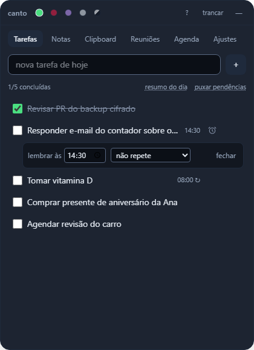
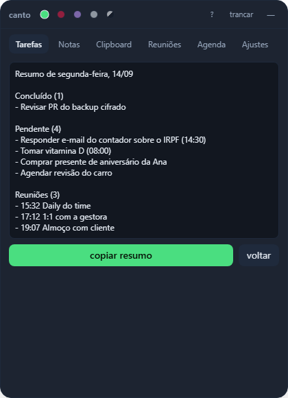
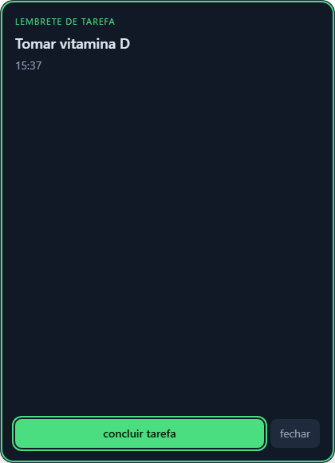
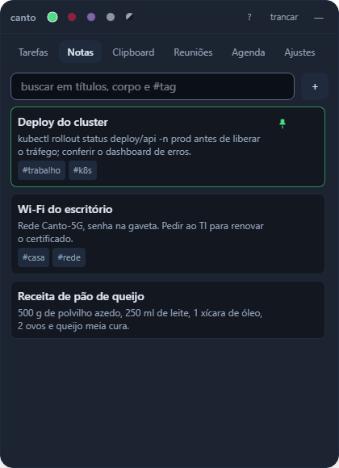
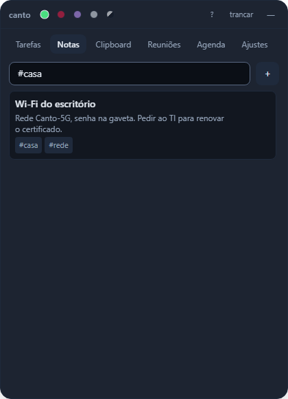
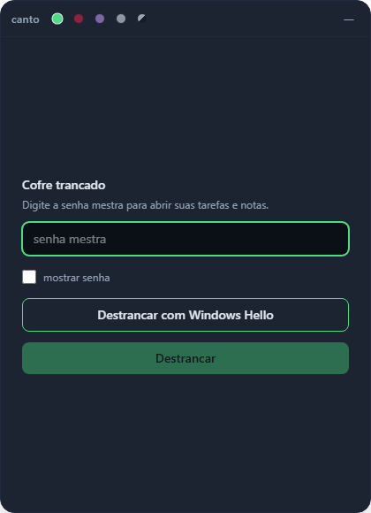
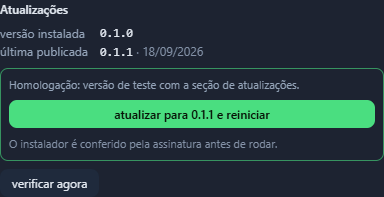
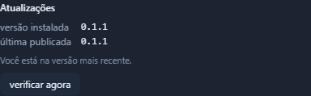

# Guia de uso

[← voltar ao README](../README.md)

## Abas locais

- **clipboard** — o Rust observa a área de transferência, guarda os últimos itens (com dedupe,
  fixar e limite de tamanho) e permite copiar de volta. Local por definição, nunca sincronizado.
  Cada card mostra o tipo (link, cor com amostra, JSON, e-mail, telefone, código com fonte monoespaçada ou
  texto), há quanto tempo foi copiado e o tamanho quando é grande. O filtro **por tipo**, ao lado da busca,
  mostra só um tipo por vez. Cópias acima de 32 mil caracteres guardam só o começo, e o card diz quanto
  foi copiado e quanto ficou; copiar de volta devolve esse trecho. O histórico inteiro tem um teto de 1 milhão de
  caracteres fora os fixados, e no Windows o Canto só lê o clipboard quando ele muda. **Máx. fixados**, ao lado
  do filtro, limita quantos itens você pode fixar (100 por padrão, até 1.000); fixar além do limite é recusado,
  desafixar sempre funciona. O atalho global **Ctrl+Alt+V** (`Cmd+Alt+V` no macOS) tira a formatação da área de
  transferência atual (nunca cola sozinho: o Canto não envia teclas para outros programas), então um `Ctrl+V`
  seu logo depois cola só texto puro.
- **reuniões** — lista as transcrições da pasta configurada (padrão `~/Documents/Transcricoes`),
  limpando numeração/timestamps de `vtt`/`srt` para virar texto corrido pesquisável. Acima dos arquivos, a seção
  **Do Gemini** lista as anotações e transcrições que o Gemini anexou às reuniões dos últimos 14 dias (exige a
  conta Google conectada); clicar abre o documento no navegador, e a busca da aba filtra pelo nome da reunião.
- **agenda** — eventos do dia do Google Calendar. Um minuto antes do início, o widget aparece,
  toca um aviso sonoro, manda uma notificação do sistema e abre um overlay com título, horário, local e o botão **entrar no Meet**
  quando o evento tem link. O relógio do aviso vive no App, não na aba: dispara com você em
  qualquer aba ou com o widget escondido. `Esc` fecha o overlay.
  Clicar num evento abre os detalhes: quem organizou, quem criou (quando é outra pessoa), quantos convidados,
  a descrição em texto puro, os anexos e **abrir no Calendar**. O overlay do aviso traz as mesmas informações.
  As **anotações do Gemini** ("Take notes for me" no Meet) viram um Google Doc anexado ao evento depois da
  chamada e aparecem ali como anexo; clicar abre o documento no navegador.

| Agenda do dia | Alerta de reunião |
|---|---|
|  |  |

## Tarefas, notas e resumo

- **Horário e lembrete** — o ⏰ da tarefa define um horário: na hora, o widget aparece com
  **lembrete de tarefa** e o botão **concluir tarefa**, e o sistema mostra uma notificação com o título da tarefa. Funciona em qualquer aba ou com o widget escondido.
- **Antecedência do lembrete** — em **Ajustes → Lembretes**, escolha avisar 5, 10, 15 ou 30 min antes do
  horário (padrão: na hora).
- **Horário direto no título** — "Daily às 9h30", "às 14h ligar para o banco" ou "Deploy 18:00" criam a
  tarefa já com o lembrete. "14h" sozinho não conta: "Estudar 2h de Rust" é duração, não horário.
- **Adiar** — o aviso de reunião ou de tarefa tem **adiar 10 min**: ele some e volta depois. Tarefa concluída
  ou apagada nesse meio-tempo não volta a tocar.
- **Recorrência** — todo dia, dias úteis ou toda semana no mesmo dia. A tarefa do dia é criada
  quando o dia chega, com id determinístico (`<série>-<dia>`): duas máquinas geram a mesma e o merge
  não duplica. Excluir o dia de hoje não apaga a série; "não repete" encerra. "Puxar pendências"
  ignora tarefas recorrentes, que já ganham a sua própria.
- **Notas fixadas** — o alfinete leva o card para o topo; clicar numa `#tag` filtra só por ela.
- **Muitas notas** — a aba mostra 50 cards por vez (fixados primeiro) e **mostrar mais** traz os próximos; a busca
  procura em todos. Um card aceita até 100 mil caracteres e o título, 300.
- **Resumo do dia** — texto com o que foi concluído, o que ficou pendente, as reuniões e os **PRs/MRs que você
  abriu hoje** no GitHub e no GitLab conectados (inclusive os já mergeados), pronto para copiar. Se uma das contas
  não responder, o resumo diz qual e traz o resto.
- **Abas visíveis** — em **Ajustes → Abas visíveis**, desmarque as abas que você não usa. Os dados continuam no
  cofre, e `Alt+1`, `Alt+2`… seguem a ordem das abas que ficaram. Ajustes nunca some.

| Horário e repetição | Resumo do dia | Lembrete |
|---|---|---|
|  |  |  |
|  |  |  |

## Aparência e atalho

- Skins, escolhidas em **ajustes → Aparência**: **padrão**, **Hueco Mundo** (Bleach), **Drácula**, **Claro** e **Sistema**, que segue o tema
  claro/escuro do sistema operacional e troca sozinha quando ele muda. A clara passa AA em todo texto.
- **Atalhos** — `Alt+1`…`Alt+7` trocam de aba, `F11` entra e sai da tela cheia, `N` cria tarefa ou card, `/` busca, `Alt+L` tranca e
  `?` mostra a lista. Teclas soltas não valem dentro de campos de texto.
- Atalho global **Ctrl+Alt+Espaço** (`Cmd+Alt+Espaço` no macOS) mostra/esconde o widget.
- **tarefas** — clique duplo no título renomeia a tarefa; `Enter` confirma, `Esc` cancela.
- **notas** — no editor, `Ctrl+Enter` salva e `Esc` cancela.
- A lista de tarefas vira sozinha à meia-noite, sem precisar reabrir o widget.
- **Teclado** — as abas seguem o padrão do WAI-ARIA: `Tab` entra na barra, `←`/`→` trocam de aba,
  `Home`/`End` vão às pontas. Todo controle mostra anel de foco, e o excluir aparece também no foco.
- **Senha** — "mostrar senha" na tela do cofre; ao criar, o mínimo de 4 caracteres fica visível.
- **Agenda** — cada evento diz em texto se é **agora**, **em 1h35** ou **encerrado**, sem depender só da cor.
- **Desfazer** — excluir tarefa, card ou item do clipboard (e limpar o histórico) não pede confirmação:
  um aviso no rodapé oferece **desfazer** por 6 s, com o prazo pausado enquanto o mouse ou o foco
  estão nele. Erros ficam até serem fechados; erro de pasta de transcrições aparece na própria aba.

### Acessibilidade das skins

Critérios aplicados, com o antes/depois em [`docs/prints/ux`](prints/ux):

| Regra | Fonte | Como ficou |
|---|---|---|
| Texto ≥ 4.5:1 | WCAG 2.2 — 1.4.3 | token `faint` clareado nas 3 skins; `on-accent` branco no Hueco Mundo |
| Borda de campo ≥ 3:1 | WCAG 2.2 — 1.4.11 | token `line` só para bordas de input |
| Alvo ≥ 24×24 px | WCAG 2.2 — 2.5.8 | skins, esconder, trancar, links e excluir com área de 24 px |
| Foco visível | WCAG 2.2 — 2.4.7 | `:focus-visible` global na cor de destaque |
| Abas por teclado | WAI-ARIA APG — Tabs | `TabBar` com `tablist`/`tab`/`tabpanel` e setas |
| Divulgação progressiva | NN/g | credenciais OAuth recolhidas quando a conta já está conectada |

### Movimento

Animações só onde mostram causa e efeito: item criado, item excluído, aviso chegando, troca de aba e cofre abrindo. Quadros de 0 a 200 ms, antes e depois, em [`docs/prints/ux-animacoes`](prints/ux-animacoes).

| Regra | Fonte | Como ficou |
|---|---|---|
| Entrar em 150–250 ms, sair mais rápido | NN/g — Animation Duration; Card, Moran & Newell (ciclo perceptivo ~100 ms) | tokens `--animate-*` em `styles.css`: aba 150, item 200, cofre 250, saída 150 |
| Desacelerar ao entrar, acelerar ao sair | Dragicevic et al., CHI 2011; Heer & Robertson, 2007 | `--ease-entrar` / `--ease-sair` |
| Só `transform` e `opacity` | web.dev — High-performance animations | nenhuma animação de layout; auditado com `document.getAnimations()` |
| Animar só o que muda | Tversky, Morrison & Bétrancourt, 2002 | lista não reanima a cada recarga, só itens que surgiram depois dela (`useNovos`) |
| Respeitar "reduzir movimento" | WCAG 2.2 — 2.3.3; `prefers-reduced-motion` | sem deslocamento: fade de 100 ms, e exclusões somem na hora |

| padrão | Hueco Mundo | Drácula |
|---|---|---|
|  |  |  |

Atalho global escondendo e trazendo o widget de volta:

| Ctrl+Alt+Espaço | Ctrl+Alt+Espaço de novo |
|---|---|
|  |  |

## Janela

- Ancorada na **work area** do monitor atual (fora da barra de tarefas/dock), margem de 16 px.
- Sem decoração e fora da barra de tarefas; arraste pelo cabeçalho e redimensione pelas bordas.
- Fundo fora dos cantos arredondados totalmente transparente no Windows, macOS e Linux. No macOS isso usa a
  API privada de transparência (`macOSPrivateApi`), o que impede publicar na Mac App Store; no Linux depende de
  um compositor ativo.
- **Tela cheia** pelo botão ⤢ do topo ou `F11`. Em tela cheia a posição e o tamanho do canto não são
  sobrescritos: ao sair, o widget volta ao que era.
- Posição e tamanho ficam em `janela.json`. Se o monitor sumir ou a janela não couber mais, ela volta ao canto.
  Em **ajustes**: "sempre na frente das outras janelas" e "voltar ao canto e ao tamanho original".
- Fechar apenas esconde. Ícone na bandeja: mostrar/esconder, **entrar na próxima reunião com Meet** (atualiza
  sozinho a cada ~90 s enquanto o cofre está destrancado), trancar cofre, sair. O atalho global
  **Ctrl+Alt+M** (`Cmd+Alt+M` no macOS) faz a mesma coisa sem abrir o menu; sem reunião em breve, não faz nada.
- **Indicador no ícone**: soma tarefas de hoje ainda não concluídas com PRs/MRs com revisão pedida a você.
  No macOS aparece o número exato no Dock; no Windows e Linux, um ponto vermelho (a API do sistema não dá
  para desenhar números sem depender de uma fonte).

## Atualizações

**Ajustes → Atualizações** mostra a **versão instalada** e a **última publicada** (com a data), verificadas ao abrir
a aba ou em **verificar agora**. Havendo versão nova, aparecem as notas do release e o botão **atualizar para X e
reiniciar**: o Canto baixa mostrando o progresso, confere a assinatura, instala e abre de novo com o cofre trancado.
Em fundo, o app verifica 5 s depois de abrir e a cada 6 h, e avisa uma vez por versão nova com um atalho para
Ajustes. Sem internet, o aviso de fundo fica quieto; a seção mostra o erro quando você pede para verificar.

No Windows, o instalador roda em modo passivo (só a barra de progresso) e usa o mesmo formato da instalação
original, `.exe` ou `.msi`. No macOS e no Linux, o app se reinicia sozinho depois de instalar.

| Versão nova disponível | Depois de atualizar |
|---|---|
|  |  |

## Iniciar junto com o computador

Ligado por padrão na primeira execução do app instalado e controlável na aba **ajustes** ("abrir o Canto ao ligar o
computador"). A partir daí a escolha do usuário manda: o padrão não volta a ligar o que ele
desligou. Quando o sistema abre a app no boot, ela sobe com `--autostart` e fica **apenas na
bandeja**, sem pular na tela; o cofre continua trancado até a senha ser digitada.
Builds de debug (`tauri dev`) não registram nada no boot.

Só roda **uma instância**: abrir o Canto de novo com ele na bandeja apenas traz o widget para a
frente.

No Windows a entrada vive em `HKCU\SOFTWARE\Microsoft\Windows\CurrentVersion\Run` (valor
`Canto`); no macOS/Linux, no launcher de sessão do usuário.
